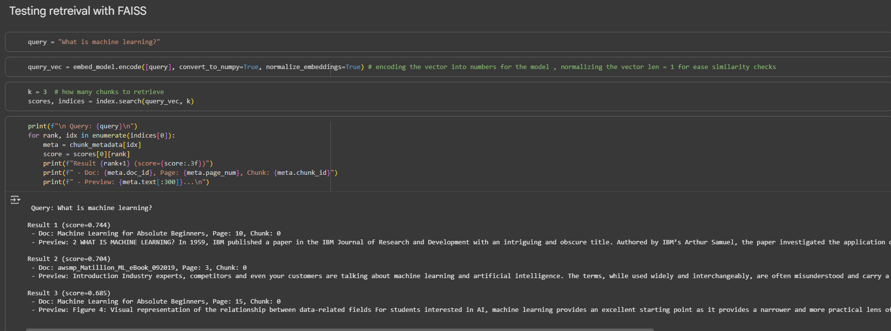
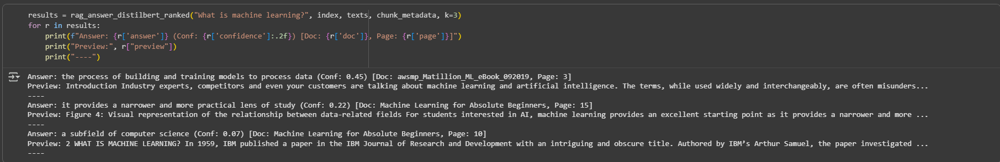
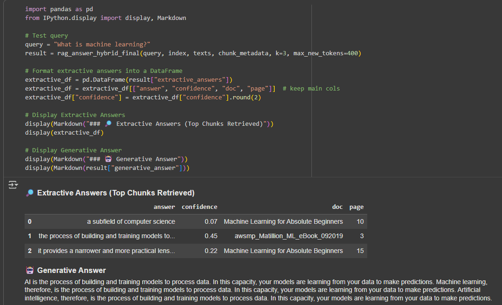

# 🧠 Mini AI-Powered RAG System

A lightweight **Retrieval-Augmented Generation (RAG)** pipeline for **document Q&A**.  
This project demonstrates a **hybrid approach** that combines **extractive** and **generative** models to provide accurate and fluent answers from uploaded documents.  

---

## ✨ Features
- 📄 **PDF ingestion & parsing** (multi-document support)  
- 🧹 **Text preprocessing & chunking** for embeddings  
- 🔎 **Semantic search with FAISS** for fast retrieval  
- 🧩 **Hybrid QA**:  
  - **Extractive QA (DistilBERT)** → precise span extraction  
  - **Generative QA (Flan-T5 / GPT)** → fluent, human-like responses  
- ⚡ Robust pipeline that balances **accuracy** and **readability**  
- 🔐 Optional GPT integration via **OpenRouter API**  

---

## 🧩 Hybrid Approach

This project is not a basic RAG — it’s engineered with a **hybrid design**:

- **Extractive QA (DistilBERT)**  
  Selects the most relevant text span directly from the retrieved chunks.  
  ✅ Precise and always grounded in the source.  

- **Generative QA (Flan-T5 / GPT)**  
  Generates a natural, summarized answer conditioned on retrieved context.  
  ✅ Human-like readability and flexibility.  

**Why Hybrid?**  
Real-world systems must be both **trustworthy** and **user-friendly**.  
- Extractive = **trustworthy** (faithful to documents)  
- Generative = **user-friendly** (smooth, natural answers)  

This combination ensures answers are **accurate, fluent, and robust**.  

---

## 🛠️ Tech Stack
- **Python 3.10+**
- [SentenceTransformers](https://www.sbert.net/) – embeddings
- [FAISS](https://faiss.ai/) – vector search
- [Transformers](https://huggingface.co/transformers/) – Flan-T5 & DistilBERT
- [PyPDF](https://pypi.org/project/pypdf/) – PDF parsing
- Optional: [OpenRouter](https://openrouter.ai) – GPT integration  

---

## 📸 Screenshots

### 🔎 FAISS Retrieval Preview


### 🎯 Extractive Answer (DistilBERT)


### 🗣️ Generative Answer (Flan-T5)


### ⚡ End-to-End Pipeline

📄 PDFs 
   ↓
🧹 Preprocessing & Chunking
   ↓
🔎 FAISS Vector Search
   ↓
   ├─ 🎯 DistilBERT (Extractive QA)
   └─ 🗣️ Flan-T5 (Generative QA)
   ↓
⚡ Hybrid Answer


---
## 🚀 Installation
Clone the repo and install dependencies:

```bash
git clone https://github.com/sr6awi/mini-ai-powered-rag.git
cd mini-ai-powered-rag
pip install -r requirements.txt

